Pierwszą częścią laborki, było wykonanie 9 prostych zadań. Wszystkie funkcje z tej części znajdują się w pliku zadania.js.

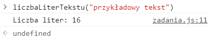
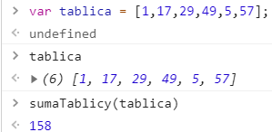
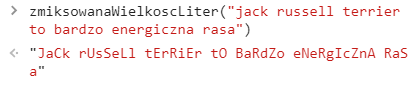
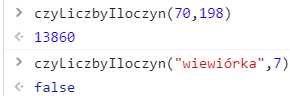
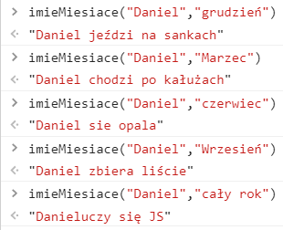
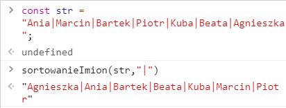
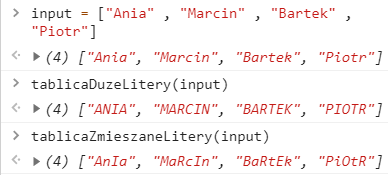
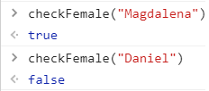
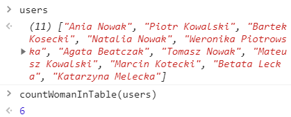

Drugą częścią zadania było stworzenie strony wykorzystującej 10 eventListenerów

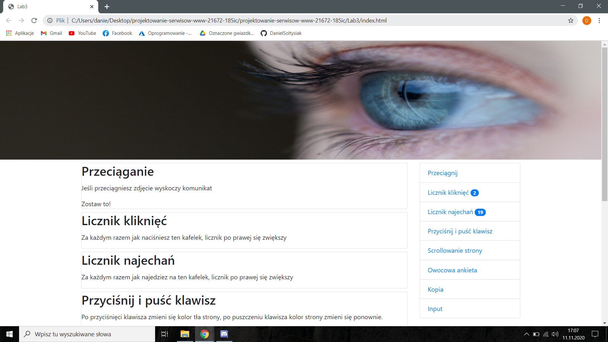
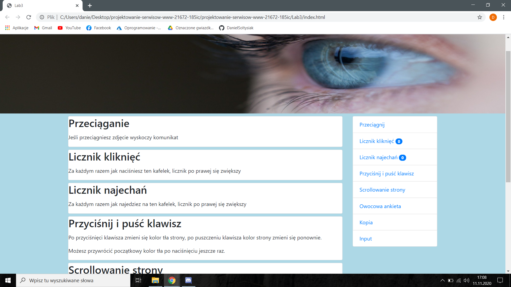
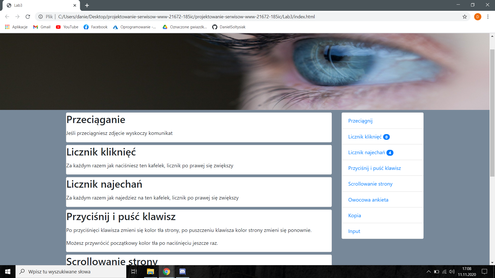
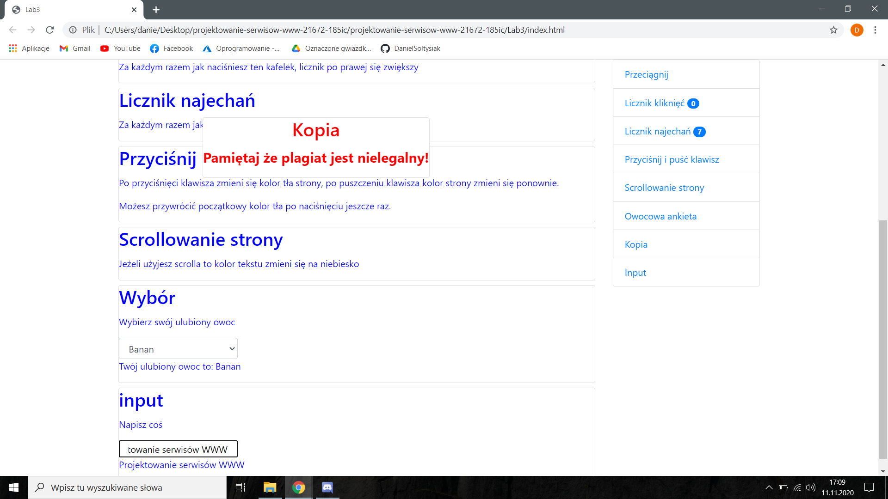