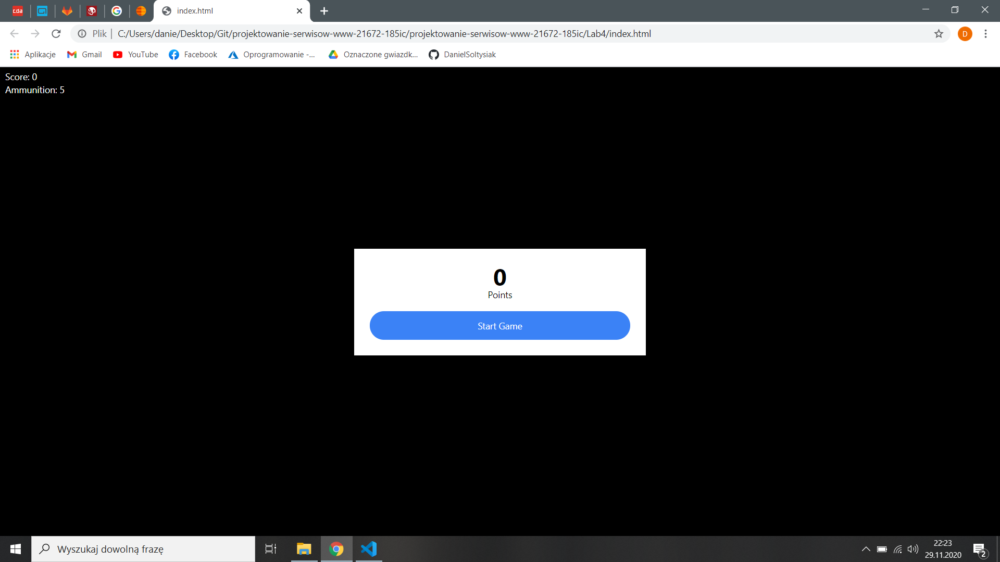
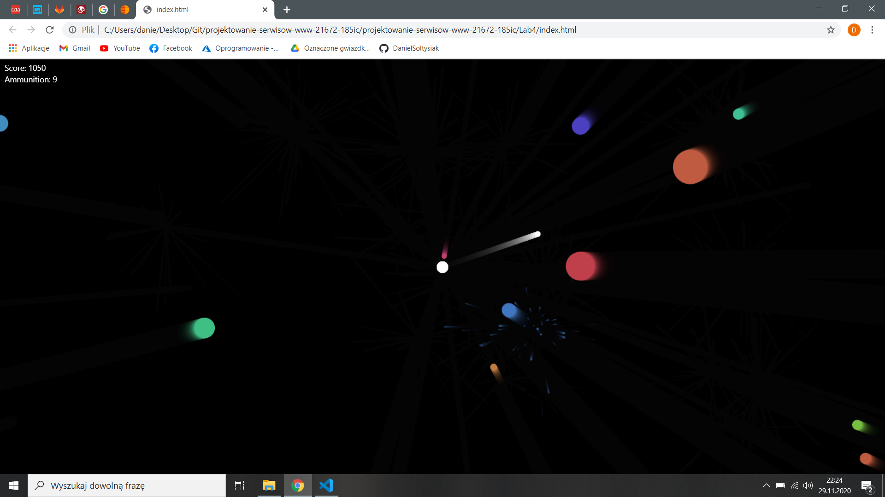
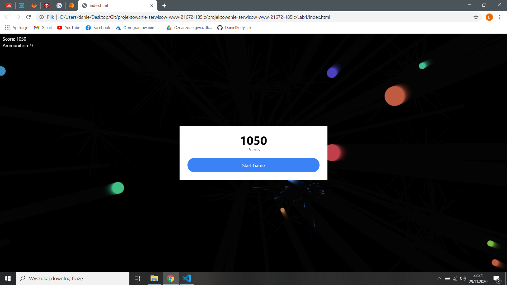

Celem laboratorium było wykonanie prostej gry przeglądarkowej. Wykonałem grę z ["HTML5 Canvas and JavaScript Game Tutorial"](https://www.youtube.com/watch?v=eI9idPTT0c4&t=4967s).

Gra polega na strzelaniu pociskami do przeciwników w kształcie koła, którzy przemieszczają się w naszą stronę. Gdy któryś nas dotknie gra się kończy.

Dodałem prostą mechanikę amunicji. Zaczynamy z 5. pociskami. Pociski odejmowane są gdy wylecą poza krawędź ekranu. Za zabicie przeciwnika otrzymujemy 2 pociski. Gdy skończy nam się amunicja przegrywamy.

