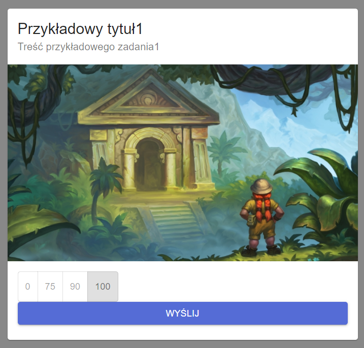
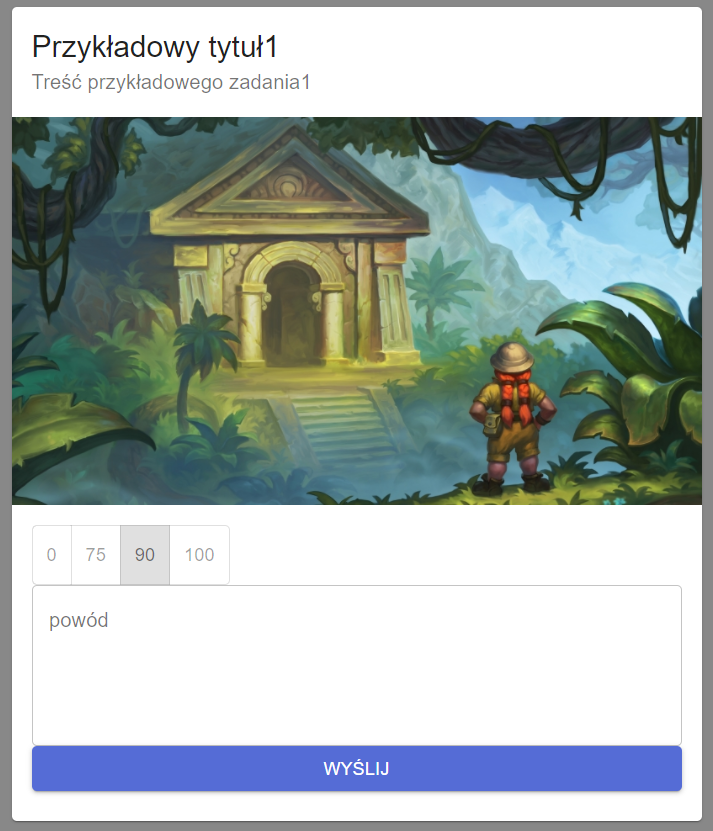
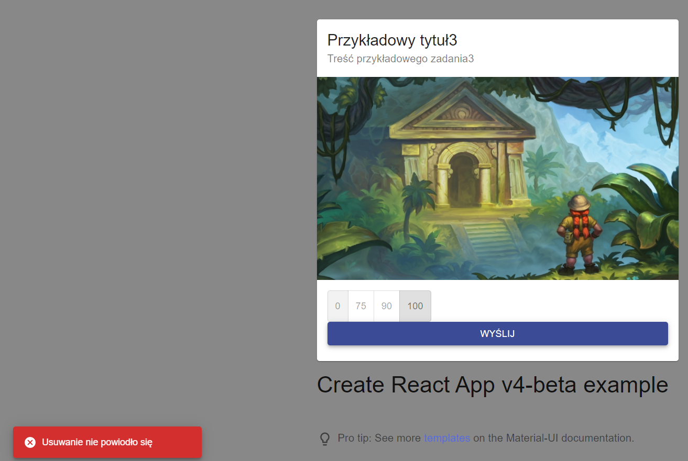

Do wykonania zadania korzystałem z Material UI. Strona wyświetla elementy z zadaniami do wykonania w grze. Po wybraniu opcji pojawia się pole tekstowe. Po naciśnięciu "wyślij" element znika, lub pojawia się informacja o błędzie.

