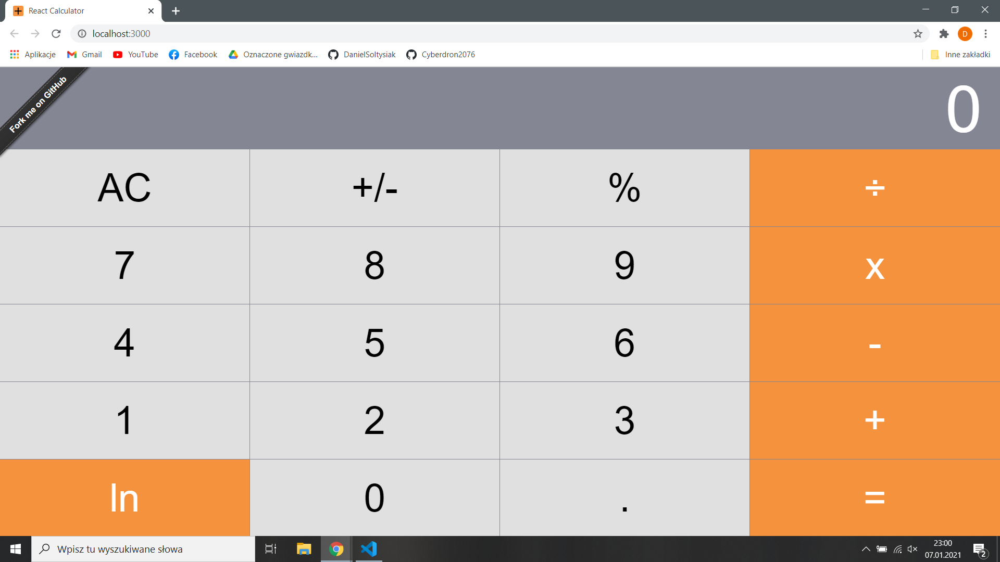
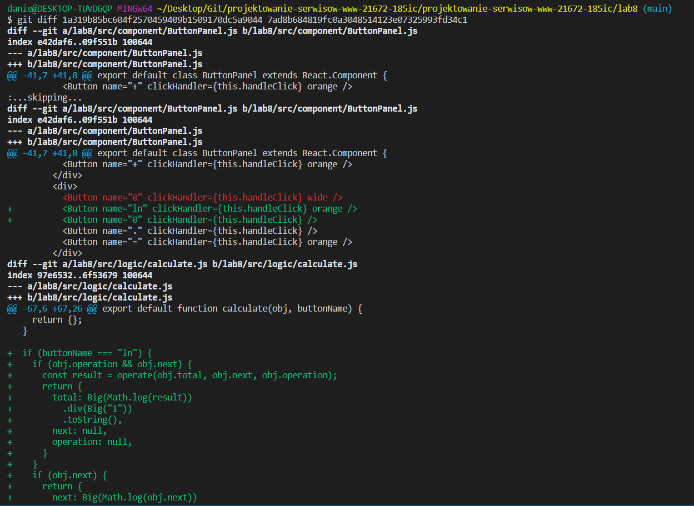
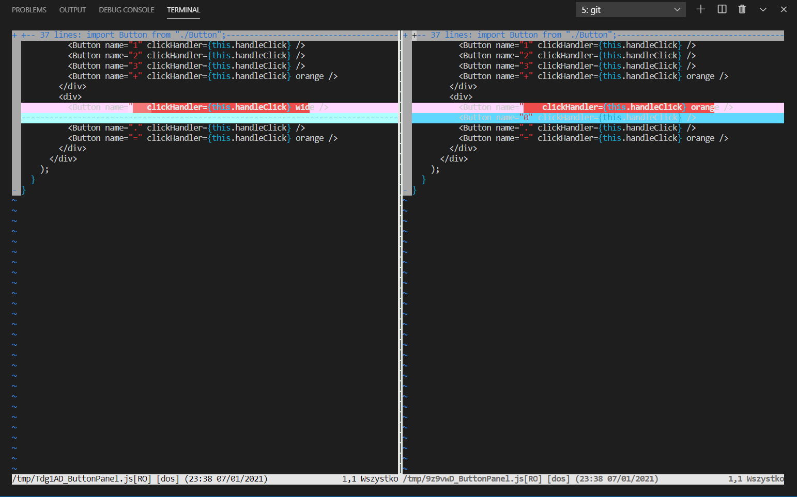

# Projektowanie Serwisów WWW Lab8

## Wygląd strony



## Link do przykładu

https://github.com/ahfarmer/calculator

## Kod aplikacji
### App.js
```javascript
// Import pakietów
import React from "react";
import Display from "./Display";
import ButtonPanel from "./ButtonPanel";
import calculate from "../logic/calculate";
import "./App.css";

// Eksportowana klasa
export default class App extends React.Component {
  // Ustawienie stanu początkowego aplikacji
  state = {
    total: null,
    next: null,
    operation: null,
  };

  // Funkcja wywoływana przy naciśnięciu przycisku
  // Ustawia stan za pomocą komponentu calculate
  handleClick = buttonName => {
    this.setState(calculate(this.state, buttonName));
  };

  // Zwracany div - składa się z komponentów Display i Button Panel
  // Funkcja Display odpowiada "za wyświetlacz" kalkulatora
  // Funkcja ButtonPanel odpowiada za "klawiaturę"
  render() {
    return (
      <div className="component-app">
        <Display value={this.state.next || this.state.total || "0"} />
        <ButtonPanel clickHandler={this.handleClick} />
      </div>
    );
  }
}
```
### calculate.js
```javascript
import Big from "big.js";

import operate from "./operate";
import isNumber from "./isNumber";

/**
 * Given a button name and a calculator data object, return an updated
 * calculator data object.
 *
 * Calculator data object contains:
 *   total:String      the running total
 *   next:String       the next number to be operated on with the total
 *   operation:String  +, -, etc.
 */
export default function calculate(obj, buttonName) {
  if (buttonName === "AC") {
    return {
      total: null,
      next: null,
      operation: null,
    };
  }

  if (isNumber(buttonName)) {
    if (buttonName === "0" && obj.next === "0") {
      return {};
    }
    // If there is an operation, update next
    if (obj.operation) {
      if (obj.next) {
        return { next: obj.next + buttonName };
      }
      return { next: buttonName };
    }
    // If there is no operation, update next and clear the value
    if (obj.next) {
      const next = obj.next === "0" ? buttonName : obj.next + buttonName;
      return {
        next,
        total: null,
      };
    }
    return {
      next: buttonName,
      total: null,
    };
  }

  if (buttonName === "%") {
    if (obj.operation && obj.next) {
      const result = operate(obj.total, obj.next, obj.operation);
      return {
        total: Big(result)
          .div(Big("100"))
          .toString(),
        next: null,
        operation: null,
      };
    }
    if (obj.next) {
      return {
        next: Big(obj.next)
          .div(Big("100"))
          .toString(),
      };
    }
    return {};
  }

  // Dodana przeze mnie funkcja odpowiedzialna za logarytm naturalny
  // Działanie tej funkcji jest zbliżone do funkcji wywoływanej jeśli buttonName jest równy "%"

  // Jeśli obj.operation i obj.next nie są null to wykonywana jest na nich operacja
  // Następnie zwracany jest total równy logarytmowi naturalnemu z wyniku operate
  // Ln jest obliczany za pomocą funkcji Math.log

  // Jeśli obj.operation jest null to zwracany jest next równy logarytmowi z obj.next
  if (buttonName === "ln") {
    if (obj.operation && obj.next) {
      const result = operate(obj.total, obj.next, obj.operation);
      return {
        total: Math.log(result).toString(),
        next: null,
        operation: null,
      }
    }
    if (obj.next) {
      return {
        next: Math.log(obj.next).toString(),
      }
    }
  }

  if (buttonName === ".") {
    if (obj.next) {
      // ignore a . if the next number already has one
      if (obj.next.includes(".")) {
        return {};
      }
      return { next: obj.next + "." };
    }
    return { next: "0." };
  }

  if (buttonName === "=") {
    if (obj.next && obj.operation) {
      return {
        total: operate(obj.total, obj.next, obj.operation),
        next: null,
        operation: null,
      };
    } else {
      // '=' with no operation, nothing to do
      return {};
    }
  }

  if (buttonName === "+/-") {
    if (obj.next) {
      return { next: (-1 * parseFloat(obj.next)).toString() };
    }
    if (obj.total) {
      return { total: (-1 * parseFloat(obj.total)).toString() };
    }
    return {};
  }

  // Button must be an operation

  // When the user presses an operation button without having entered
  // a number first, do nothing.
  // if (!obj.next && !obj.total) {
  //   return {};
  // }

  // User pressed an operation button and there is an existing operation
  if (obj.operation) {
    return {
      total: operate(obj.total, obj.next, obj.operation),
      next: null,
      operation: buttonName,
    };
  }

  // no operation yet, but the user typed one

  // The user hasn't typed a number yet, just save the operation
  if (!obj.next) {
    return { operation: buttonName };
  }

  // save the operation and shift 'next' into 'total'
  return {
    total: obj.next,
    next: null,
    operation: buttonName,
  };
}
```
### ButtonPanel.js
```javascript
// Import pakietów
import Button from "./Button";
import React from "react";
import PropTypes from "prop-types";

import "./ButtonPanel.css";

// Eksportowana klasa
export default class ButtonPanel extends React.Component {
  static propTypes = {
    clickHandler: PropTypes.func,
  };

  handleClick = buttonName => {
    this.props.clickHandler(buttonName);
  };

// Klasa zwraca klawiaturę kalkulatora
// W ostatnim divie dodałem przycisk "ln" dodałem do niego klasę orange
// Z przycisku 0 usunąłem klasę wide
  render() {
    return (
      <div className="component-button-panel">
        <div>
          <Button name="AC" clickHandler={this.handleClick} />
          <Button name="+/-" clickHandler={this.handleClick} />
          <Button name="%" clickHandler={this.handleClick} />
          <Button name="÷" clickHandler={this.handleClick} orange />
        </div>
        <div>
          <Button name="7" clickHandler={this.handleClick} />
          <Button name="8" clickHandler={this.handleClick} />
          <Button name="9" clickHandler={this.handleClick} />
          <Button name="x" clickHandler={this.handleClick} orange />
        </div>
        <div>
          <Button name="4" clickHandler={this.handleClick} />
          <Button name="5" clickHandler={this.handleClick} />
          <Button name="6" clickHandler={this.handleClick} />
          <Button name="-" clickHandler={this.handleClick} orange />
        </div>
        <div>
          <Button name="1" clickHandler={this.handleClick} />
          <Button name="2" clickHandler={this.handleClick} />
          <Button name="3" clickHandler={this.handleClick} />
          <Button name="+" clickHandler={this.handleClick} orange />
        </div>
        <div> 
          <Button name="ln" clickHandler={this.handleClick} orange />
          <Button name="0" clickHandler={this.handleClick} />
          <Button name="." clickHandler={this.handleClick} />
          <Button name="=" clickHandler={this.handleClick} orange />
        </div>
      </div>
    );
  }
}
```
## GitDiff
Za pomocą polecenia gitdiff sprawdziłem różnice pomiędzy commitem ze skopiowaną aplikacją, a commitem z dodaną przeze mnie funkcjonalnością

Widać tutaj dodanie nowego przycisku na klawiaturze w pliku ButtonPanel.js, oraz dodanie obsługi tego przycisku w calculate.js.
<br>
Warto zauważyć, że usuwanięcie jednej klasy z klawisza 0 wyświetlone jest jako usunięcie tego klawisza i dodanie na nowo bez tej klasy.

## GitDiffTool
użycie polecenie git difftool wyświetla nam proste GUI z wykonanymi zmianami
